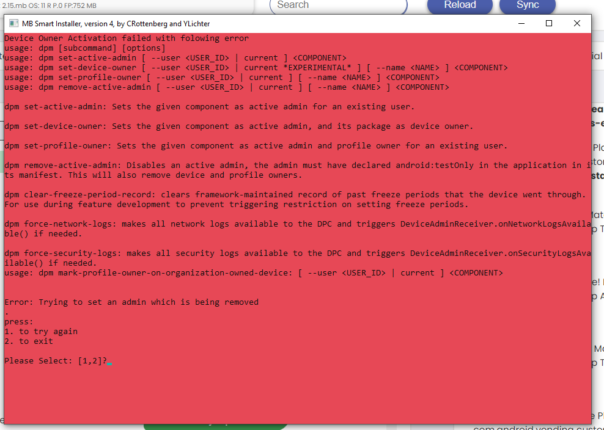
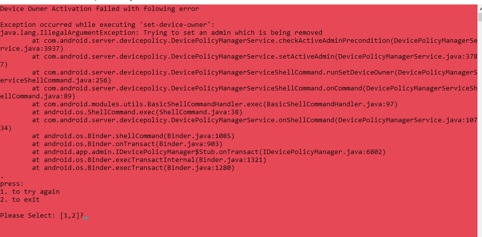

# MB Smart Android Insallation Troubleshooting:

## Known installer error codes:

- A screen that looks like either one of these:
  
  
  Indicates that you are trying to install the filter while the device owner that was present is currently being removed, and waiting a minute or two would be recommended.
- Otherwise, _c_ ...
- These are placeholders for real troubleshooting steps, please excuse me while compiling them into a comprehensive list.
